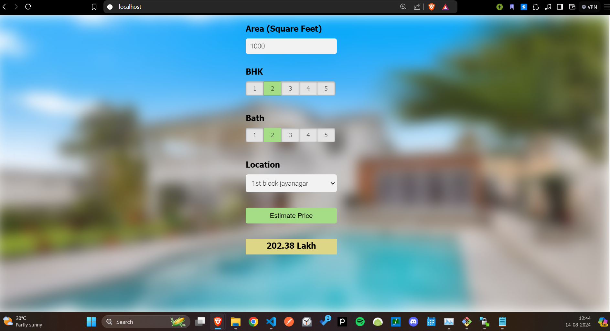

## Overview
This project demonstrates a complete pipeline for building a real estate price prediction system. The system includes data preprocessing, model training, and a web application to serve predictions.

## Features
- **Data Preprocessing**: Clean and prepare data for model training.
- **Model Building**: Use linear regression and other machine learning techniques for price prediction.
- **Flask Server**: Serve predictions via a Flask API.
- **Web Interface**: HTML/CSS/JavaScript front-end for user interaction.

## Technologies Used
- **Python**: Programming language used for data processing and server-side logic.
- **Numpy & Pandas**: Data manipulation and analysis.
- **Matplotlib**: Data visualization.
- **Scikit-Learn**: Machine learning model building, including K-Fold Cross-Validation.
- **Flask**: Web framework for serving the model.
- **HTML/CSS/JavaScript**: Front-end technologies for user interface.

## Model Training
- **Data**: Bangalore home prices dataset from Kaggle.
- **Techniques**:
  - Data cleaning and feature engineering
  - Outlier detection and removal
  - GridSearchCV for hyperparameter tuning
  - K-Fold Cross-Validation for model evaluation

## Setup Instructions
1. **Clone the Repository**
   ```bash
   git clone https://github.com/harshcoder7/Real_Estate_price_prediction_ML.git
   cd Real_Estate_price_prediction_ML

#Install Dependencies
 pip install -r requirements.txt

#Run the Flask Server
python server/app.py



